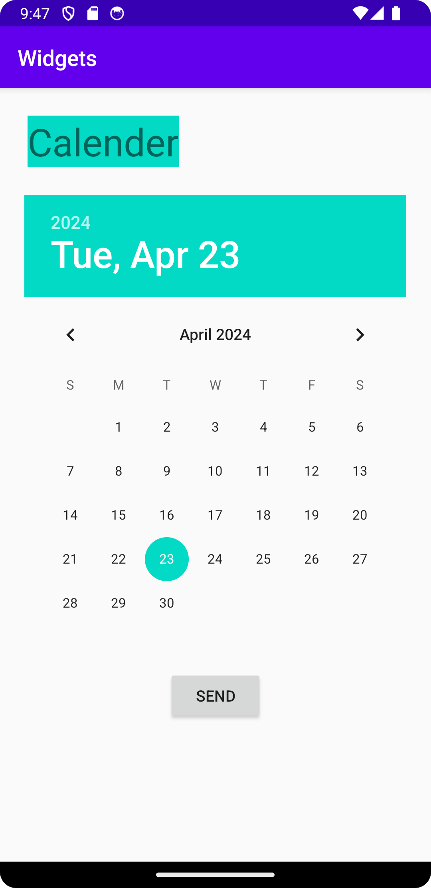

# Rapport

Först skapades en linear layout innehållande en vertikal orientering inuti activity_main.xml
```
<LinearLayout xmlns:app="http://schemas.android.com/apk/res-auto"
    xmlns:tools="http://schemas.android.com/tools"
    xmlns:android="http://schemas.android.com/apk/res/android"
    android:layout_width="match_parent"
    android:layout_height="match_parent"
    android:orientation="vertical"
    tools:context=".MainActivity">
</LinearLayout>
```
Sedan lade jag till 3st olika widgets. Dessa är textview, datepicker och button. (Koden visar widgets efter
att ursprungliga positionen ändrats).
```
    <TextView
        android:layout_width="wrap_content"
        android:layout_height="wrap_content"
        android:background="@color/colorAccent"
        android:layout_margin="25dp"
        android:text="@string/textview"
        android:textSize="35sp"/>


    <DatePicker
        android:layout_width="wrap_content"
        android:layout_height="wrap_content"
        android:layout_gravity="center"/>

    <Button
        android:layout_width="wrap_content"
        android:layout_height="wrap_content"
        android:text="@string/button"
        android:layout_gravity="center"/>
```
För att ändra positionen i textview var det android:margin som möjligjorde detta. 
```
android:layout_margin="25dp"
```
För att ändra positionen i datepicker samt button var det android:layout_gravity som möjligjorde detta.
Koden gör att elementen centreras.
```
android:layout_gravity="center"
```
För att lägga till text på ett korrekt sätt skapades strings inuti strings.xml som refereras i 
textview och button.
```
<resources>
    <string name="app_name">Widgets</string>
    <string name="textview">Calender</string>
    <string name="button">Send</string>
</resources>
```
Resultat:


